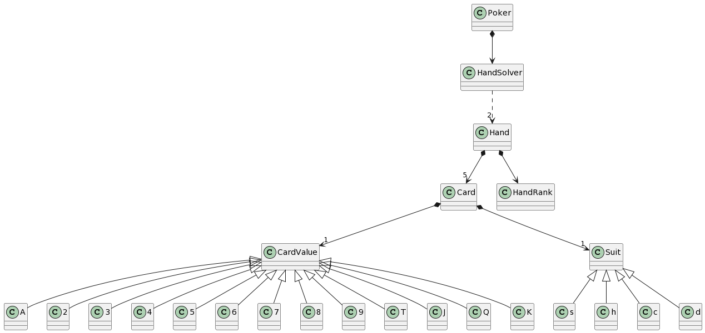

### Description

Poker hand solver programming exercise. Given two five card poker hands, evaluate which of the two is the higher hand, and return that highest hand as output. Given to hands with same rank it should tiebreak between them.

### Install

```bash
npm install
```

### Run unit testing
```bash
npm run test
```

### Run express backend
```bash
npm run dev:poker:backend
```
Default **port** is 5000. You can change it using setting environment variable PORT.

```bash
PORT=6000 npm run dev:poker:backend
```


### Query backend example
In another terminal run
```bash
curl -X POST -H "Content-Type: application/json" -d '{"hands": [["9c", "3h", "Jh", "5d", "7c"], ["9s", "3d", "Kh", "5c", "7h"] ] }' http://localhost:5000/hands/solve
```
**Hands** property is an array of strings representing card notation **value** and **suit**.

Allowed **suits** are **'c'** for Clubs, **'h'** for Hearts, **'d'** for Diamonds and **'s'** for Spades.

Allowed card **values** are **'2'**, **'3'**, **'4'**, **'5'**, **'6'**, **'7'**, **'8'**, **'9'**, **'T'** for 10, **'J'**, **'Q'**, **'K'**, **'A'**.

So for example 10 of Spades notation is **'Ts'**.

Suits and Values are **case insensitive** and any not allowed suit or value should trigger an error and backend should return http status 400 (Bad request).

The request should be a **POST** to **/solve** route with Json that contains a field called **hands** which is an array of two arrays of 5 cards.


### Architecture

The solution has been designed following **hexagonal architecture** with some bits of **DDD**.

<details>
  <summary> Click to see folder structure</summary>

```text
.
├── README.md
├── jest.config.js
├── package-lock.json
├── package.json
├── src
│   ├── app
│   │   └── poker
│   │       └── backend
│   │           ├── controller
│   │           │   ├── controller.ts
│   │           │   └── handSolverPostController.ts
│   │           ├── pokerBackendApp.ts
│   │           ├── route
│   │           │   ├── handSolver.route.ts
│   │           │   └── index.ts
│   │           ├── server.ts
│   │           └── start.ts
│   └── context
│       ├── poker
│       │   ├── card
│       │   │   └── domain
│       │   │       ├── card.ts
│       │   │       ├── cardValue.ts
│       │   │       ├── invalidCardNotationError.ts
│       │   │       ├── invalidCardSuitError.ts
│       │   │       ├── invalidCardValue.ts
│       │   │       └── suit.ts
│       │   └── hand
│       │       ├── domain
│       │       │   ├── hand.ts
│       │       │   ├── handRank.ts
│       │       │   ├── invalidHandCardCountError.ts
│       │       │   └── repeatedCardError.ts
│       │       └── service
│       │           └── handSolverService.ts
│       └── shared
│           └── domain
│               └── valueObject
│                   ├── invalidArgumentError.ts
│                   └── valueObject.ts
├── test
│   ├── app
│   │   └── poker
│   │       └── backend
│   │           └── route
│   │               └── handSolver.route.test.ts
│   └── context
│       └── poker
│           ├── card
│           │   └── domain
│           │       ├── card.test.ts
│           │       ├── cardValue.test.ts
│           │       └── suit.test.ts
│           └── hand
│               ├── domain
│               │   └── hand.test.ts
│               └── service
│                   └── handSolverService.test.ts
└── tsconfig.json

28 directories, 31 files
```
</details>


**Business Logic** is inside folder _src/Context/Poker_ which is the bounded context in this scope. We have two entities  which are **Card** (which encapsulates two value objects **CardValue** and **Suit**) and **Hand**. To compare two hands (the proposed problem) there is a application service called **HandSolverService** who take two hands and returns the hightest hand or nothing if is not possible tiebreak.

**Applications** inside __src/app__ acts as a controller. In this case there is an nodejs express web backend placed _src/app/poker/backend_. to query the domain service and return the winner hand. We could also create a **cli** or **websocket** service and reuse the same application service because the logic is not coupled with the tech stack used to ask the result. That is because the architecture follows layer dependency rule.

<p align="center">
  
</p>

### Ubiquitous Language



### Request hand solve


